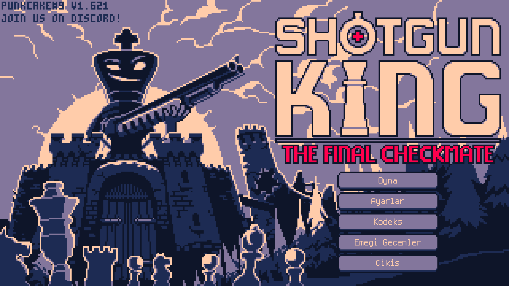
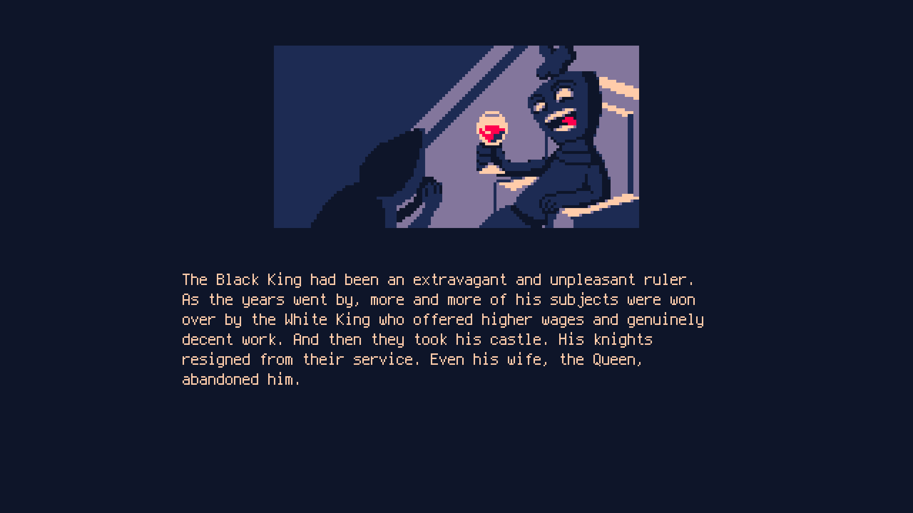
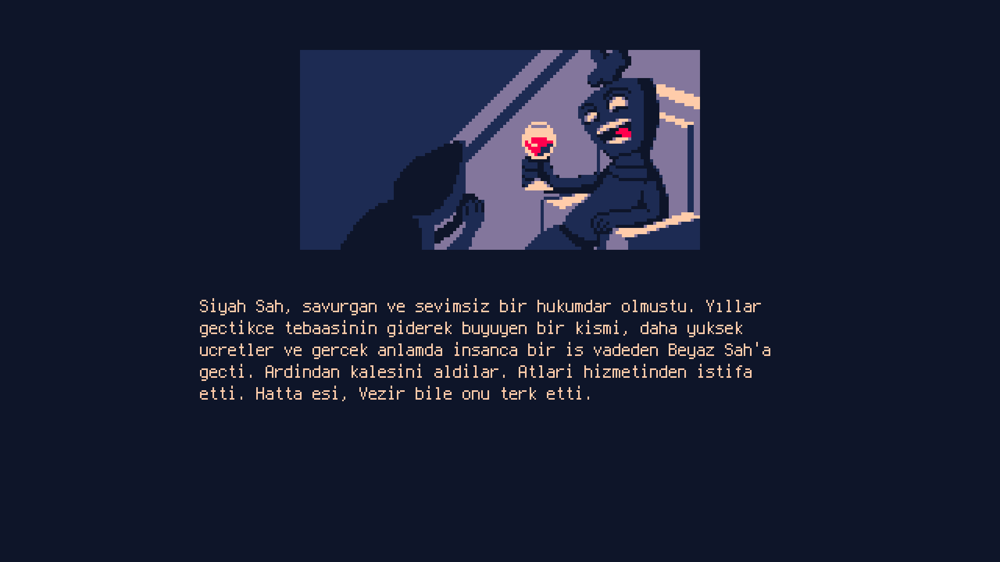
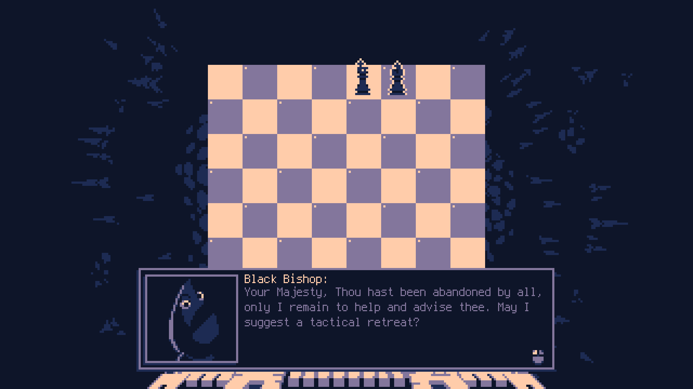
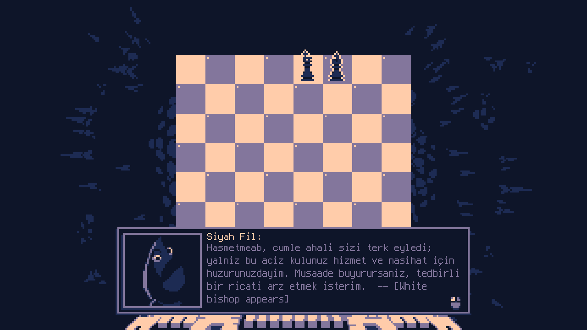

# Shotgun King Turkish Localization

This is a Turkish translation for Shotgun King: The Final Checkmate.

## Author
Created by Yusuf Soylu

## Features
- Menu: 100% translated
- UI: 99% translated
- Gameplay texts: fully translated

## Installation
1. Go to your game directory:
   Steam/steamapps/common/Shotgun King
2. Copy the "lang" folder into the game directory
3. Select Turkish in language settings

## Notes
- Turkish characters will be improved in future updates

## Version
v1.0

## Screenshots

## Contribution
Contributions are welcome.
